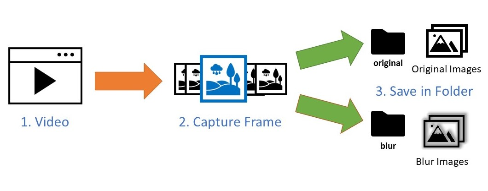
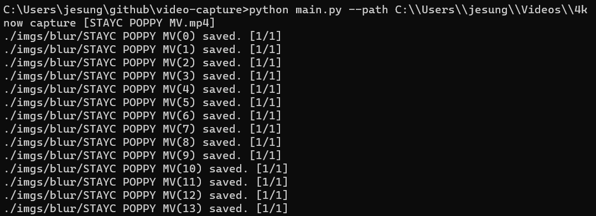
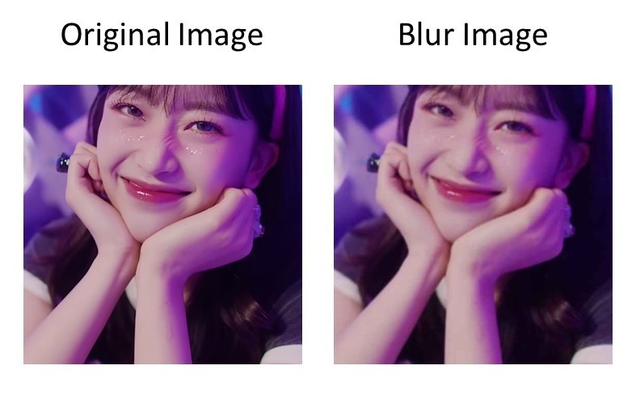
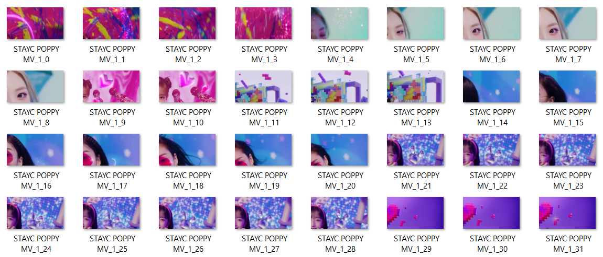

# What is video-capture?
video-capture is a tool that extracts images by reading frames from a video.

This is a script to create a dataset for Super Resolution Training.


## How to install video-capture

### Clone the repository
```
https://github.com/jesunglim/video-capture.git
```

### Install required packages
video-capture requires just OpenCV and Pandas

```
pip install opencv-python
pip install pandas
```

or

```
cd video-capture
pip install -r requirements.txt
```

## How to run video-capture
For linux or macOS, just change the path.
```
cd video-capture
# Generic
python main.py --path [video folder path]

# Example
python main.py --path C:\\Users\\jesung\\Videos\\4k
```


## Arguments
|   Arguments   |       Explation
|:-------------:|:------------------------------------:|
|   path        |   Path containing videos to be captured
|   frame       |   Frame cycle to capture. If it is 24, capture once every 24 frames.
|   split_num   |   numbers of divide screen. options are None, 4.
|   gaussian    |   Gaussian Filter Kernel Size.   Recommend 1~3
|   compres     |   Resolution size to be compressed for blur
|   outpres     |   Resolution of the final blur image

## Result
Crop Result


Saved split images

